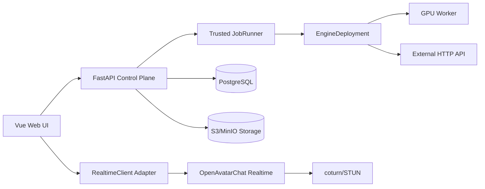

<!-- /autoplan restore point: C:/Users/56905/.gstack/projects/data-man/no-branch-autoplan-restore-20260715-145602.md -->
# NOVA 组装式双引擎数字人平台实施计划

状态：`/autoplan` 全部评审与最终视觉 gate 已通过，计划批准实施
前提门：用户于 2026-07-15 确认方案 C2

## Summary

- 复用 OpenAvatarChat 0.6.x 与 OpenAvatarChat-WebUI 构建实时语音数字人，并采用其已集成的 SoulX-FlashHead 将单张人物图驱动为带眨眼、头部动作和同步嘴型的实时流式说话头。
- 离线成片使用 EchoMimicV3 生成音频驱动的人像/上半身动作，MuseTalk 1.5 做嘴型精修，CosyVoice 负责声音；通过 EngineDeployment 运行在远程 GPU 云主机或第三方 HTTP API。
- 首版最终范围同时包含实时互动与文案生成 MP4；实施先完成一条真实纵切，通过许可证、质量、WebRTC 和成本四个门槛后再展开完整平台。
- 前端从 OpenAvatarChat-WebUI 浅 Fork，保留通信与状态代码，重做未来科技界面；若 Spike 证明边界不可分离，则改为独立薄 RealtimeClient，不维持半 Fork 半重写。
- 当前为内部单用户，但所有数据访问和对象键从首版按固定 workspace/owner 隔离；登录、多租户、知识库、计费和公开 SaaS 不在首版。

## Product Success Gates

平台工程只有在真实纵切同时通过以下门槛后继续：

1. **许可证**：锁定代码 commit、模型权重哈希、CUDA/镜像版本；形成 SPDX/NOTICE 清单，逐项确认托管、再分发、署名、模型数据、专利与 codec/native 义务。
2. **质量**：同一测试人物完成实时与成片对比；音画偏移 P95 不高于 120ms，人工人物一致性、声音自然度、口型自然度每项至少 4/5，无持续性面部破损。
3. **实时性**：预热条件下，用户结束说话到首个带同步口型的可听响应 P95 不高于 3 秒；TURN-only、5 分钟以上会话、凭证刷新和过期后重连通过验收。
4. **成本与产能**：记录目标 GPU、显存、冷/热启动、每分钟成片时间与成本。默认门槛为 1 分钟 1080p 成片不超过 10 分钟、推理成本不超过 5 元人民币；超过时先协商为 720p 或更换 Engine/ExecutionTarget。
5. **真实使用**：从文案到可用 MP4 的修改轮数不超过 3 次；完成至少 5 次连续真实任务后再决定发音修正、字幕校正和局部重生成的优先级。

## What Already Exists

| 子问题 | 复用项目/能力 | 使用方式 |
|---|---|---|
| 实时会话编排 | OpenAvatarChat 0.6.x | 主实时引擎；复用 ASR/LLM/TTS/Avatar、双工打断与会话管理 |
| 浏览器通信 | OpenAvatarChat-WebUI | 浅 Fork；保留 InitConfig、WebRTC/WebSocket、Realtime 状态和 AvatarHandler |
| 离线口型成片 | MuseTalk 1.5 | 作为 VideoGenerationPipeline 的 RenderEngine |
| 声音克隆/合成 | CosyVoice | 作为 VoiceEngine；保存引擎专属 VoiceEnrollment |
| Avatar 创建与录制 | LiveTalking | 仅可选 adapter；受 README 水印声明约束，不进入默认路径 |
| 完整数字人平台参考 | CyberVerse | 仅参考，不复制 GPL-3.0 代码进入核心 |
| RTC/TURN | OpenAvatarChat RTC + coturn | 复用原生媒体协议；Control Plane 不转码 |

## Scope and Phasing

### Milestone 0：Go/No-Go Spike

- 使用一份合规测试人物视频、声音和文案，跑通 OpenAvatarChat 实时链路与 MuseTalk/CosyVoice 到 MP4。
- 完成许可证清单、WebUI 模块边界审计、GPU/驱动/CUDA 支持矩阵、托管 API buy/build 对比。
- 托管 API 比较首次可用时间、每分钟成本、质量、数据外发、可定制能力和维护工时；胜出的 API 作为一个 ExecutionTarget，不推翻控制层。
- 任一门槛失败时按替换规则更换 WebUI 策略、Engine、模型权重、输出规格或实例；不绕过领域契约。

### Milestone 1：最窄真实纵切

- 上传和预检来源素材，生成引擎专属 AvatarVersion/VoiceEnrollment。
- 完成一次真实实时语音互动、字幕与打断。
- 完成一次文案到 MP4、进度、失败恢复和下载。
- 使用一个 GPU 云主机；`dev` profile 的确定性 Mock 验证协议、状态、打断 ACK、任务阶段、失败恢复和固定示例 MP4，但不证明人物、声音、口型或真实延迟质量。

### Milestone 2：内部可用产品

- 完成实时互动、视频创作、形象与声音资产、算力与系统设置四个工作区。
- 加入一个真实 HTTP API ExecutionTarget，验证 capability、轮询/回调、取消、幂等和结果回收。
- 完成 dev/full 部署 profile、持久任务、对象存储、TURN、观测和备份恢复。

## NOT in Scope

- 登录注册、多用户邀请、组织权限和公开 SaaS：首版固定单用户 workspace，但数据访问从首版带 scope。
- 计费、套餐和商业运营后台：先记录 JobAttempt 成本元数据，不制作收费产品。
- 企业知识库、RAG、工具型 Agent：与数字人核心效果验证无直接关系。
- CyberVerse 整体 Fork：GPL-3.0 与高 GPU 绑定不符合未来可选闭源路径。
- 默认 LiveTalking 成片：水印声明构成发布约束，只保留可选 adapter。
- 局部重生成、字幕编辑器和高级时间线：观察 5 次真实制作流程后决定，记录为后续候选。
- 多区域、多集群和自动扩缩容：出现真实并发和容量数据后设计。

## Architecture

### Product-Owned Boundaries

- `RealtimeClient` 是浏览器稳定领域接口：`connect/sendText/sendAudio/interrupt/disconnect`，输出 `state/transcript/stream/error`。原始信令只存在于 OpenAvatarChat adapter 内。
- `RealtimeEngine`、`RenderEngine`、`VoiceEngine` 描述算法与任务协议；`ExecutionTarget` 只描述运行位置、认证、网络、队列和存储方式。
- `EngineDeployment` 绑定有效 Engine 与 ExecutionTarget，持有 adapter、凭证引用、配置 revision、健康状态和最终 capabilities；任务不能任意组合 Engine 与 Target。
- `OpenAvatarChatRealtimePipeline` 内部编排实时 ASR/LLM/TTS/Renderer；`VideoGenerationPipeline` 由可信 JobRunner 顺序调用 CosyVoice 和 MuseTalk。
- 同一 SourceMedia 派生不同引擎专属 AvatarVersion/VoiceEnrollment，不承诺模型产物跨引擎通用。



### Data and Security

- PostgreSQL 是资产、任务、attempt 和状态的唯一事实源；对象存储只保存不可变媒体对象。
- `SourceMedia` 保存原始文件与媒体探测结果；`AvatarAsset/AvatarVersion`、`VoiceAsset/VoiceEnrollment` 保存逻辑资产与引擎产物。
- 所有核心表、repository 查询、唯一索引、缓存键和对象键前缀携带 `workspace_id`；管理员令牌映射到固定 owner/workspace。
- `ConsentRecord` 记录来源声明、主体、用途范围、有效期、撤销和保留策略；内部版不把数据库记录当作法律证明，另维护供应商保留清单与可执行删除流程。
- 管理员令牌首次启动一次性生成，只使用 HttpOnly/Secure/SameSite cookie 或进程内存；Engine/API 密钥使用 OS 密钥库或环境主密钥加密，支持轮换。
- 上传、回调、SSE、WebSocket、WebRTC 信令和预签名 URL 都使用短期凭证；回调用 timestamp、nonce 和 HMAC 防重放。
- Cookie 鉴权的写操作同时校验同源 `Origin/Referer` 与 `X-CSRF-Token`；CORS 使用显式 allowlist，WebSocket 握手校验 Origin 与一次性 session token，禁止凭证落入 URL、localStorage 或日志。
- ffprobe/FFmpeg 和媒体预处理在无网络、rootless、只读根文件系统的隔离容器运行，并设置 CPU、内存、时长、输出大小和临时盘限制。外部结果下载经过固定 egress proxy，每次 DNS 解析和重定向都阻断私网、环回、链路本地和云 metadata 地址；默认不跟随跨域重定向。

### Realtime Session Contract

- `POST /api/v1/realtime/sessions` 创建会话，返回 session ID、engine 类型、RealtimeClient 配置和 5 分钟短期凭证。
- `POST /api/v1/realtime/sessions/{id}/credentials/refresh` 刷新凭证，`DELETE` 结束会话。
- 断线宽限期 60 秒；同 session 重连保留服务端对话历史、LLM context 和字幕序号，重新建立 media peer，未完成发言标为 interrupted 且不自动重播。
- 实时媒体浏览器直连 OpenAvatarChat：优先 STUN/UDP，失败后 TURN over UDP/TCP/TLS；Control Plane 不转码。
- PostgreSQL 保存 `RealtimeSession`、turn/transcript、字幕序号、OAC session binding 和凭证 epoch；OpenAvatarChat 只持有可丢失的媒体/推理运行态。OAC 重启后平台恢复历史并建立新 media peer，但不承诺恢复未完成音频帧或模型内部流状态，用户看到“会话已恢复，上一轮已中断”。
- 会话状态固定为 `creating/connecting/active/reconnecting/ending/ended/failed`，状态更新使用乐观版本；凭证 refresh 递增 epoch，旧 epoch 立即拒绝新握手。超过 60 秒或显式结束后不能复活原 session，只能新建并选择是否复制对话历史。

### Offline Job Contract

- `POST /api/v1/video-jobs` 使用 `Idempotency-Key` 提交 script、AvatarVersion、明确的 VoiceEnrollment、EngineDeployment 和输出参数；SSE 推送阶段与状态。若 UI 只选择 VoiceAsset，Control Plane 必须在请求校验阶段解析为唯一兼容 enrollment，并将其写入请求回执，禁止 Runner 运行时再选择。
- `VideoJob` 是逻辑任务；每次执行建立 `JobAttempt` 和不可变 `ExecutionPlan`，冻结资产版本、脚本哈希、模型版本、deployment revision、协商规格和 capability snapshot。
- 可信 `JobExecutionService/JobRunner` 获取和续租 DB lease、调用 adapter、执行重试/对账和发布产物；远程 Worker/API 不直接访问 PostgreSQL。
- `VideoJob` 保存用户级投影 `queued/running/reconciling/succeeded/failed/cancelled/needs_attention` 与 `desired_state=run|cancel`；`JobAttempt` 保存执行级状态 `pending/leased/submitting/running/reconciling/cancel_requested/succeeded/failed/cancelled/detached`。只有 JobExecutionService 可执行转换，终态不可逆，迟到回调只写审计。
- 每次 DB claim 生成单调递增 `fencing_token`；状态更新、远端操作关联、staging artifact 和最终发布都必须携带 `attempt_id + fencing_token + row_version` 并使用条件更新。失去 lease 的旧 Runner 无法发布或覆盖新 attempt。
- lease 过期先进入 `reconciling`。只有目标支持同客户端键重放，或 adapter 证明未提交，才重新排队；无法确认远端状态则进入 `needs_attention/manual_resolution_required`，禁止自动重提。人工动作仅允许“继续对账”“确认放弃并隔离迟到结果”“以新幂等键创建新 Job”。
- 幂等记录按 `workspace_id + endpoint + Idempotency-Key` 唯一，保存 canonical request SHA-256 和完整首次响应，保留到 Job 删除后至少 30 天；同 key 同 payload 重放原响应，同 key 不同 payload 返回 409，两个并发请求只能创建一个 Job。
- Job、首次 Attempt 与 OutboxEvent 在同一 PostgreSQL 事务写入；Outbox Dispatcher 可重复投递 `job_id`，Celery 只作唤醒信号。Runner 必须从 DB 条件 claim，配置 `acks_late=true`、`worker_prefetch_multiplier=1`、每个长任务子进程一次执行后回收，并以 DB 状态而非 Celery 状态判断完成。
- 供应商结果优先预签名直传；只返回 URL 时由受限 Ingestion Worker 按域名 allowlist、大小、时长和超时拉取，校验 SHA-256 与媒体 manifest 后发布。
- `GET /api/v1/video-jobs/{id}` 返回 `state_version` 与 `event_cursor`；SSE 接收 `Last-Event-ID` 或 `after`，从 PostgreSQL 事件日志重放 cursor 之后的事件。cursor 过期时发送 `resync_required` 并关闭，客户端重新拉带新 cursor 的快照再订阅，彻底消除“先快照后订阅”的丢事件窗口。

`ExecutionTargetAdapter v1` 是统一公共接口：`discover_capabilities`、`validate_execution_plan`、`submit`、`get_status`、`cancel`、`fetch_result_manifest`、`normalize_error`、`health_check`。每个 DeploymentRevision 必须声明客户端幂等有效期、能否按 client request ID 反查、取消/收费语义、回调 event ID/顺序、结果 URL 生命周期、重试矩阵和最大并发；既不支持幂等也无法按 client reference 反查的供应商不能通过生产 gate。

远程 GPU Worker 使用出站 HTTPS 长轮询领取任务，首版不要求开放入站控制端口。管理员一次性 bootstrap 后签发可轮换的 mTLS client certificate；Worker 上报 GPU/显存、驱动、CUDA、镜像 digest、模型哈希、warm readiness 和并发槽。任务凭证只允许读取本次输入、写入本次 staging prefix，并在完成/超时后失效；Worker 本地 spool 按 attempt 清理并由启动时 janitor 回收遗留目录。

### Media Contract

- 输入：H.264/AAC MP4、PNG/JPEG、16/24-bit PCM WAV、UTF-8 文本；ffprobe 校验，音频预处理为 16kHz mono PCM。
- 素材预检输出可执行报告：人脸可见率、多人/遮挡、帧率和分辨率、音频信噪与削波、时长、引擎兼容性及具体修复建议；不合格素材不能进入付费/耗时推理。
- 输出候选：H.264 High Profile + AAC-LC MP4、yuv420p、1080p/25fps；实际规格由 AvatarVersion、RenderEngine 与 ExecutionTarget capability 取交集，必要时降为 720p/25fps。
- Worker 负责最终编码；原始素材、派生产物、中间文件和成片分别配置保留期、配额与引用安全 GC。

### Deployment Profiles

- `dev`：Web、Control Plane、Mock、PostgreSQL、本地兼容对象存储、LocalDispatcher；不要求 GPU、Redis、Celery 或 TURN。
- `full`：增加 Redis/Celery、OpenAvatarChat、GPU Worker、MinIO、coturn 和反向代理。
- LocalDispatcher 和 Celery adapter 调用同一个 JobExecutionService，运行同一状态转换、lease、幂等和取消契约测试。
- 实时与离线任务使用不同 GPU/主机，或同主机显式 GPU reservation、实时优先级与并发上限。实时满载时拒绝新会话并返回可重试时间，离线任务保持 queued。
- 通过 P95 实时门槛的 full profile 必须将实时与离线部署到不同 GPU；同 GPU 只允许开发/降级 profile，默认离线并发 1，运行中任务无 checkpoint 时不抢占，新的实时会话返回 busy 与预计等待时间。
- 交付物固定为 `compose.dev.yml`、`compose.full.yml`、Windows Docker Desktop 启动/doctor 脚本和独立 CUDA Worker 镜像；CPU 服务发布 `linux/amd64` 镜像，GPU Worker 首版支持 `linux/amd64 + NVIDIA Container Toolkit`，Windows 只作为浏览器与 Docker Desktop 控制端。
- 数据库迁移使用 Alembic expand/contract：先加兼容字段、双读/回填、切换、下个版本再删除；每个发布支持回退一个应用版本。PostgreSQL 每日备份并执行月度恢复演练，对象存储开启版本/保留策略；内部版目标 RPO 24 小时、RTO 4 小时。
- 上游 OpenAvatarChat/WebUI 固定 commit 和补丁清单，每月在独立分支同步并运行 adapter/视觉回归；不直接修改保留的通信模块。Redis 不作为事实源，无需备份恢复任务状态。

### Observability and Capacity

- 浏览器请求、`VideoJob`、`JobAttempt`、远端 operation 和 artifact 共享 `trace_id/request_id/job_id/attempt_id`；结构化日志禁止脚本、密钥、声音样本和预签名 URL，供应商响应只保存脱敏摘要与受限原文引用。
- OpenTelemetry 覆盖 Control Plane、Outbox、Runner 与 adapters；核心指标包括实时分段 P50/P95、ICE/TURN 成功率、队列年龄、各阶段耗时、lease 丢失、reconciliation 年龄、GPU 显存/OOM、供应商 429/5xx、产物校验失败和每分钟成本。
- 告警门槛：连续 5 分钟实时 P95 超 3 秒、队列最老任务超 15 分钟、reconciling 超 2 分钟、任一双发布/fencing 拒绝、校验失败或备份失败立即告警；每项配套 runbook。
- Milestone 1 验收容量固定为 1 个活跃实时会话、每个离线 deployment 1 个运行任务、20 个排队任务；所有性能结果必须记录 GPU SKU、驱动/CUDA、模型哈希、素材时长/分辨率、脚本长度、并发、冷/热定义和样本数。容量扩大只改 deployment limits 与 admission policy，不改任务协议。

## Error and Rescue Registry

| Codepath | Named error | Rescue action | User sees | Test |
|---|---|---|---|---|
| 素材上传/预检 | `InvalidMediaError` | 拒绝持久化，返回具体格式/质量问题 | 可修复建议 | 边界文件、空文件、伪装 MIME |
| 授权校验 | `ConsentRequiredError` / `ConsentRevokedError` | 阻止新任务并触发派生资产清理 | 重新确认或素材已撤销 | 撤销竞态 |
| 实时创建 | `RealtimeEngineUnavailableError` | 不分配会话，返回健康信息和重试时间 | 服务暂不可用 | Engine down |
| ICE/媒体 | `MediaNegotiationError` | ICE restart，再降级 TURN | 网络连接建议 | TURN-only/NAT |
| 凭证刷新 | `SessionExpiredError` | 终止旧会话，允许建立新会话 | 会话已过期 | 5 分钟后重连 |
| LLM 调用 | `LLMTimeoutError` / `LLMRateLimitError` / `EmptyLLMResponseError` | 有界退避；保持会话可打断 | 思考超时或服务繁忙 | timeout/429/空流 |
| Voice/Avatar | `EnrollmentMissingError` / `CapabilityMismatchError` | 提交前拒绝并列出兼容 deployment | 资产不兼容 | 交叉引擎资产 |
| 任务提交 | `DuplicateRequestError` | 返回原 job ID，不重复扣费 | 已存在任务 | 并发双击 |
| 远端执行 | `RemoteStateUnknownError` | 进入 reconciling，禁止盲目重提 | 正在核对，最终明确失败 | 非幂等 API 崩溃 |
| 结果回收 | `UnsafeResultUrlError` / `ChecksumMismatchError` | 隔离结果并告警 | 结果校验失败 | SSRF/校验和 |
| 对象存储 | `StorageUnavailableError` / `QuotaExceededError` | 有界重试或拒绝新上传 | 存储暂不可用/空间不足 | outage/quota |
| Worker lease | `LeaseLostError` | 停止发布，交给 reconciliation | 任务重新核对 | 双 Worker |

## Failure Modes Registry

| Codepath | Failure mode | Rescued | Test | User visible | Logged |
|---|---|---:|---:|---:|---:|
| 上传 | 空文件、错误编码、超限 | Yes | Yes | Yes | Yes |
| 实时 | 麦克风拒绝、断线、TURN 失败 | Yes | Yes | Yes | Yes |
| LLM/TTS | 超时、429、空响应、拒绝 | Yes | Yes | Yes | Yes |
| 离线任务 | 双击、重复投递、lease 过期 | Yes | Yes | Yes | Yes |
| HTTP API | 无幂等、无取消、无回调 | Yes | Yes | Yes | Yes |
| 回调 | 重放、伪造、迟到、乱序 | Yes | Yes | Yes | Yes |
| 结果 | SSRF、超大文件、校验失败 | Yes | Yes | Yes | Yes |
| 存储 | 中断、配额、孤儿对象 | Yes | Yes | Yes | Yes |
| 删除 | 授权撤销、部分清理失败 | Yes | Yes | Yes | Yes |
| GPU | OOM、掉帧、实时抢占 | Yes | Yes | Yes | Yes |

## CEO Review

### Mode and Premise Verdict

- 模式：SELECTIVE EXPANSION。
- 用户已确认：保留双引擎 C2，不降为单链路 Demo；以真实纵切和四个硬门槛控制完整平台展开。
- CEO 独立声音建议首版只产品化一个链路；主评审不同意削减明确需求，但接受其风险判断并改为里程碑门控。

### Alternatives Considered

| Approach | Completeness | Effort | Risk | Verdict |
|---|---:|---:|---:|---|
| C1：OpenAvatarChat 单引擎并录制 | 7/10 | M | 中 | 拒绝，离线质量与调度能力不足，未来可能重做 |
| C2：OpenAvatarChat 实时 + MuseTalk/CosyVoice 离线 | 10/10 | L | 中高 | 采用，最符合双场景与上线演进要求 |
| C3：CyberVerse 整体 Fork | 9/10 | L | 高 | 拒绝，GPL、高 GPU 与上游绑定过强 |

### Selective Expansion Decisions

| Proposal | Decision | Reason |
|---|---|---|
| 素材质量预检与修复建议 | Accepted | 在现有上传 blast radius 内，可直接减少昂贵失败任务 |
| 托管数字人 API buy/build 基准 | Accepted | 作为 ExecutionTarget 验证，不复制控制层能力 |
| 发音修正、字幕校正、局部重生成 | Deferred | 先观察 5 次真实制作流程，避免猜测编辑需求 |
| Provider 成本分析面板 | Deferred | 先记录 JobAttempt 成本，真实多目标后再做 UI |
| 多用户/SaaS/RAG | Skipped | 不影响内部双引擎核心价值 |

### Dual-Voice Consensus

| Question | Main review | Independent CEO | Consensus |
|---|---|---|---|
| Premises valid | 分阶段 C2 有效 | 平台过早 | YES，加入门控 |
| Right problem | 避免重做并复用开源 | 先证明用户价值 | YES，纵切优先 |
| Scope calibration | 保留两条明确需求 | 只做一条产品链路 | DISAGREE，用户确认保留 C2 |
| Alternatives explored | C1/C2/C3 + 托管 API | 缺 buy/build | YES，补 buy/build |
| Long-term trajectory | EngineDeployment 可演进 | 抽象固化过早 | YES，契约先 experimental |
| Product success | 系统与质量均需门槛 | 原计划偏系统正确性 | YES，补质量/成本/使用门槛 |

### Dream State Delta

```text
CURRENT                 THIS PLAN                         12-MONTH IDEAL
空目录、无素材/GPU  ->  可验证双引擎内部产品        ->  一套个人数字人工作台
                         稳定领域契约与外部算力适配       可切换质量/成本最优引擎
                         实时互动 + 可用成片              按真实工作流补编辑与自动化
```

### CEO Implementation Tasks

- [ ] **CEO-T1 (P1)** — 完成许可证、WebUI 边界、真实质量和 GPU 网络四项 go/no-go Spike。
- [ ] **CEO-T2 (P1)** — 实现素材预检报告与硬拒绝规则，避免坏素材进入推理。
- [ ] **CEO-T3 (P1)** — 用同一素材完成实时/成片质量、延迟、显存和成本基线。
- [ ] **CEO-T4 (P2)** — 比较一个托管 API 并作为真实 HTTP ExecutionTarget 验证契约。
- [ ] **CEO-T5 (P2)** — 固定上游 commit、模型哈希、镜像与替代方案/最大替换成本。

### CEO Completion Summary

| Item | Result |
|---|---|
| Mode | SELECTIVE EXPANSION |
| System audit | 空目录，无 Git/代码；只有旧 PLAN.md |
| Strategic issues | 14 条独立挑战，全部通过门控、明确范围或后续条件处理 |
| Critical gaps remaining | 0 |
| Scope proposals | 5 proposed, 2 accepted, 2 deferred, 1 skipped |
| Existing code leverage | OpenAvatarChat、WebUI、MuseTalk、CosyVoice、coturn |
| Reversibility | 4/5；引擎可替换，领域数据和浏览器接口稳定 |
| UI scope | Detected，进入完整 Design Review |
| Unresolved decisions | 0 |

## Test Plan Baseline

- 单元：状态转换、workspace scoping、capability 交集、ExecutionPlan 冻结、媒体校验、错误映射、HMAC 与令牌。
- 契约：RealtimeClient、每个 EngineDeployment、LocalDispatcher/Celery、直传/拉取结果、回调乱序与幂等。
- 集成：PostgreSQL Outbox/lease/reconciliation、对象存储、OpenAvatarChat、MuseTalk/CosyVoice、TURN。
- E2E：首次 Mock 使用、真实实时会话、真实文案成片、断线重连、取消、失败重试、下载与删除。
- Chaos：Worker 崩溃、重复投递、远端状态未知、存储中断、TURN-only、GPU OOM、Control Plane 重启。
- 质量基准：同素材人工盲评、A/V 偏移、响应分段 P50/P95、每分钟时长/成本和 5 次连续任务。

## Design Review

### Design Direction

- 类型：任务型 APP UI，不采用营销落地页结构或仪表盘卡片拼贴。
- 方向：未来科技“交互舱”，但保持安静、可操作、可信。深石墨背景、电光青单一主强调色；不使用紫蓝渐变、装饰光球、图标圆卡或大面积玻璃拟态。
- 字体：`Noto Sans SC` 用于中文正文与控件，`IBM Plex Mono` 用于状态、时间、任务 ID 和性能数字；最多两套字体。
- 颜色变量：`bg #080B0F`、`surface #10151B`、`elevated #151C24`、`border #26313D`、`text #F2F6FA`、`muted #91A0AE`、`accent #21D4FD`、`success #42D392`、`warning #F5B942`、`danger #FF5D73`、`focus #7DE7FF`。
- 间距采用 4/8/12/16/24/32px；圆角仅使用 6/10/14px，麦克风和语义状态允许圆形；边框薄且低调，阴影只用于临时浮层。
- 动效时长 120/180/240ms，只用于状态切换、音量、任务进度和层级过渡；支持 `prefers-reduced-motion`，禁用扫描线和位移动效后仍保留清晰状态。

### Information Architecture

```text
NOVA
├─ 实时互动
│  ├─ 主视觉：数字人画面 / 空闲占位 / 连接状态
│  ├─ 主操作：按住说话、持续聆听、文字输入、打断
│  └─ 次级上下文：实时字幕、延迟、当前 Avatar/Voice
├─ 视频创作
│  ├─ 主工作区：文案编辑与分段
│  ├─ 选择：AvatarVersion / VoiceAsset / EngineDeployment
│  └─ 输出：阶段进度、失败恢复、预览、下载
├─ 形象与声音
│  ├─ 来源素材上传
│  ├─ 素材预检和修复建议
│  └─ 引擎专属 AvatarVersion / VoiceEnrollment
└─ 系统设置
   ├─ EngineDeployment 健康与能力
   ├─ 本地/GPU/API 连接配置
   └─ 高级：存储、TURN、日志和许可证
```

每个工作区只保留一个主任务：实时页先看到数字人和说话按钮；创作页先看到文案与生成；资产页先看到素材是否合格；设置页先看到部署是否可用。诊断数字、日志和高级配置默认折叠，不与主任务争夺注意力。

- 默认进入“实时互动”，不增加卡片式工作台首页。左导航底部常驻进行中任务状态，点击打开全局任务抽屉，任何工作区都能查看、取消或回到任务详情。
- 主流程使用“推荐配置、人物、声音、生成位置”等用户语言；`EngineDeployment`、`ExecutionTarget`、capability 和 request ID 只出现在高级设置、复制诊断和日志中。

### Screen Layout

- **实时互动**：左侧 72px 导航；中央数字人舞台占可用宽度至少 60%；底部中央为 64px 主麦克风控件与文字输入；右侧 360px 字幕/上下文栏。连接状态贴近舞台左上，不用全局 Toast 代替持续状态。
- **视频创作**：文案编辑区占主宽度，右侧为固定 320px 的 Avatar/Voice/Deployment 选择和单一“生成视频”动作；生成后主区域切换为分阶段进度或视频预览，不增加第二套页面。
- **形象与声音**：先显示一个上传入口和素材规范；上传后原位切换为预检结果。版本列表采用可扫描表格/时间线，不使用等宽卡片网格。
- **系统设置**：顶部先显示“当前可用/不可用”和最近检查时间；deployment 使用列表行展示名称、能力、延迟和健康；密钥只显示已配置/未配置及更新动作，不回显值。

视频创作是单页渐进流程：`文案 -> 人物/声音 -> 兼容性预检 -> 实际输出规格与预计成本确认 -> 持久任务详情`。只有当前步骤有效时显示下一步，规格从 1080p 降为 720p 或将素材发送到外部 API 时必须在提交前明确确认，可在设置中预授权同类降级。

### First-Run and User Journey

| Step | User does | Intended feeling | UI response |
|---|---|---|---|
| 1 | 首次打开 | “现在就能试，不必先配置” | 两个明确动作：体验 Mock、连接真实算力；默认突出 Mock |
| 2 | 体验互动 | “她在听我说话” | 麦克风权限前置说明；波形、字幕和 Listening/Thinking/Speaking 三态清晰 |
| 3 | 上传素材 | “系统会告诉我素材是否合格” | 即时预检，问题定位到画面/音频并给修复建议 |
| 4 | 生成成片 | “任务可预测，不会消失” | 阶段进度、预计规格、可离开提示；返回后恢复任务 |
| 5 | 查看结果 | “我知道能否使用和下一步做什么” | 预览、质量摘要、下载；失败时保留输入并提供重试/换 deployment |
| 6 | 长期使用 | “引擎可以变，资产和工作流不会丢” | 版本、来源、成本和运行记录可追溯，不暴露底层复杂度 |

### Interaction State Coverage

| Feature | Loading | Empty | Error | Success | Partial/Degraded |
|---|---|---|---|---|---|
| 实时会话 | 舞台骨架 + “正在建立安全连接” | 虚构占位形象 + 体验 Mock/选择形象 | 舞台内说明原因、重试和网络诊断 | 数字人、字幕、麦克风和打断可用 | 音频可用但 Avatar/字幕不可用时明确降级条 |
| 麦克风 | 权限请求前解释用途 | 未开始聆听，主按钮可见 | 权限拒绝给浏览器具体开启路径 | 波形 + Listening 状态 | 输入音量过低/噪声高给非阻断提示 |
| 视频任务 | 阶段名 + 不伪造百分比 | 示例文案、素材要求和“创建第一个视频” | 保留文案/选择，显示问题、是否扣费、重试方式 | 原位视频预览、下载和再次生成 | 远端状态核对中显示 reconciling，不显示假失败 |
| 素材预检 | 文件名、上传/分析阶段 | 单一上传入口 + 合规和质量说明 | 逐项列出格式、人脸、音质问题 | 合格项与目标 deployment 可用性 | 可继续但会降质的警告必须显式确认 |
| 资产列表 | 行级骨架 | 解释 Avatar 与 Voice 的区别并提供上传动作 | 保留已加载行，失败区可重试 | 表格显示版本、来源、引擎、状态 | 部分 deployment 不兼容用标签和原因表示 |
| Deployment | 独立健康检查 Spinner | Mock 可用，真实服务未配置 | 问题 + 原因 + 修复命令/字段 | 健康、能力、最近检查、延迟 | 可成片但不支持实时等能力差异明确显示 |
| 下载/删除 | 按钮局部忙碌且防双击 | 无产物则不显示下载 | URL 过期自动刷新；删除失败保持记录 | 下载完成或进入回收站 | 授权撤销后的清理进度可查看 |

用户状态字典是唯一显示来源：

| Domain state | User label | Primary action | Notification rule |
|---|---|---|---|
| `queued/leased` | 等待处理 | 取消任务 | 进入运行时通知一次 |
| `running` | 正在生成：{stage} | 查看详情 | 仅阶段变化更新，不刷 Toast |
| `reconciling` | 正在确认远端结果，不会重复提交 | 稍后查看 | 超过 2 分钟提醒 |
| `unknown_remote_state` | 暂时无法确认结果 | 联系/复制诊断、手动重试新任务 | 明确是否可能产生费用 |
| `cancel_requested` | 正在取消 | 无重复取消 | 远端确认或超时后通知 |
| `failed` | 生成失败 | 保留输入重试/换推荐配置 | 必须说明素材、费用和下一步 |
| `succeeded` | 视频已生成 | 预览、下载 | 显示实际规格和降级差异 |

所有错误文案固定回答四件事：发生了什么、素材是否安全、是否可能产生费用、下一步能做什么。CompatibilityService 统一返回 `valid/warning/blocked`、原因和修复动作；页面禁止各自复制兼容性条件。

### Responsive Rules

- `>=1280px`：72px 左导航、主舞台/编辑区、360px 右上下文三栏常驻。
- `768–1279px`：64px 图标+文字缩略导航；右上下文改为可固定的抽屉，主任务不缩小到不可用。
- `<768px`：四项底部导航；每次只显示一个主工作区。实时页舞台占上部，64px 麦克风固定在安全区上方；字幕为可上拉 sheet。视频创作选择项按顺序进入独立 sheet，不把桌面三栏机械堆叠。
- 所有触控目标至少 44×44px；移动端不依赖 hover，不隐藏主操作到更多菜单。
- 文案编辑在窄屏保留固定生成栏和未保存提示；软键盘出现时不能遮住输入、主按钮或字幕。

### Accessibility and Trust

- 使用 `nav/main/aside` landmarks、跳到主要内容链接、唯一可见页面标题；Dialog/Sheet 有焦点陷阱和关闭后焦点归还。
- 所有功能可键盘完成；焦点环 2px `focus` 色且不被裁剪。Space 控制按住说话只在按钮聚焦时生效，Esc 中断/关闭前有明确作用域。
- 状态变化通过 `aria-live` 分级播报；字幕、Thinking/Speaking、错误不只依赖颜色；波形提供文字替代。
- 视觉字幕可以逐 token 更新，但读屏 live region 只在完整句或轮次结束时播报，避免持续打断；拖放、波形和图形化预检必须有按钮与文本替代。
- 正文不低于 16px、辅助文字不低于 14px；正文对比度至少 4.5:1，关键图标/焦点至少 3:1。
- 上传前显示肖像和声音授权确认；删除、撤销授权、发送素材到外部 API 前明确目标、保留期与影响。
- Toast 仅用于瞬时确认；持续错误、降级、连接和任务状态必须留在其所属工作区。

### Long Content and Interaction Rules

- 47 字符以上名称单行截断并在聚焦/悬停时显示完整值；复制动作读出成功状态。
- 字幕保留最近上下文并虚拟化，自动滚动在用户手动上滚后暂停，提供“回到最新”。
- 文案提交前显示字符/预计音频时长；空白、纯标点和超长文本原位拒绝。
- 所有提交按钮防双击；页面离开不取消后台任务。未保存文案离开时提示，已提交任务自动恢复。
- 浏览器前进/后退保持工作区和可安全恢复的筛选状态，不恢复麦克风录音或临时密钥。

### AI Slop Guardrails

- 禁止首屏卡片矩阵、图标圆卡、紫蓝渐变、居中大标题、装饰性光斑、统一大圆角和“欢迎使用/解锁能力”等泛化文案。
- 舞台、编辑器、表格、状态条和 Sheet 都必须有功能理由；卡片只用于确实可独立选择或拖动的对象。
- 文案使用操作语言：“开始互动”“生成视频”“素材需要重新录制”，不使用“探索未来”“释放创造力”。
- 产品第一视觉锚点始终是数字人或当前作品，不是统计数字和系统配置。

### Frontend Reuse Boundary

- Spike 必须列出 WebUI 保留的通信/store 模块和可替换的 view 模块；新 UI 只消费稳定 `RealtimeViewModel` 与统一 UI 状态字典。
- NOVA token 和组件使用独立命名空间，不覆盖上游全局 CSS，不直接在页面读取 OpenAvatarChat 私有 store。
- SSE 只触发增量刷新，Control Plane 状态快照是页面恢复的事实源；刷新或断线后先拉快照再续订事件。

### Design Ratings

| Dimension | Before | After | Remaining |
|---|---:|---:|---|
| Information architecture | 3/10 | 9/10 | 实现后用真实内容密度复核 |
| Interaction states | 4/10 | 10/10 | None |
| User journey | 5/10 | 9/10 | 正式素材到位后验证编辑迭代 |
| AI slop resistance | 6/10 | 9/10 | 视觉稿尚未生成 |
| Design system | 3/10 | 9/10 | 后续生成独立 DESIGN.md |
| Responsive/accessibility | 4/10 | 9/10 | 真机与屏幕阅读器 QA |
| Decisions resolved | 4/10 | 10/10 | 用户批准按现有设计系统实施，视觉稿改为实现期验证物 |
| **Overall** | **3.4/10** | **9/10** | gstack designer 当前不可用 |

### Design Implementation Tasks

- [ ] **DES-T1 (P1)** — 建立上述颜色、字体、间距、圆角、动效 token 和基础布局。
- [ ] **DES-T2 (P1)** — 实现 RealtimeClient 状态到舞台、字幕、麦克风和降级条的完整映射。
- [ ] **DES-T3 (P1)** — 为四工作区实现 loading/empty/error/success/partial 状态表。
- [ ] **DES-T4 (P1)** — 实现三档响应式布局、键盘导航、ARIA live 和焦点管理。
- [ ] **DES-T5 (P2)** — 实现素材预检报告、修复建议和外部发送信任提示。
- [ ] **DES-T6 (P2)** — gstack designer 可用后生成并批准实时页、视频创作页视觉稿。
- [ ] **DES-T7 (P1)** — 建立 RealtimeViewModel、CompatibilityService 和后端状态到用户状态的唯一字典。
- [ ] **DES-T8 (P1)** — 隔离上游通信/store 与 NOVA view/token，禁止全局 CSS 覆盖。

### Design Dual-Voice Consensus

| Topic | Main design review | Independent designer | Result |
|---|---|---|---|
| Navigation | 四工作区，默认实时页 | 建议增加工作台和任务页 | 采用四工作区 + 全局任务抽屉，避免 dashboard 增生 |
| Engineering language | 技术信息可见 | 主流程会泄漏 Engine 概念 | 统一用户语言，技术字段移到高级诊断 |
| Realtime states | 状态表覆盖 | 缺完整 UI 状态机 | 增加唯一 UI 状态字典和 RealtimeViewModel |
| Video journey | 编辑区 + 设置 | 缺屏幕级步骤 | 固定单页渐进流程与规格/费用确认 |
| Visual identity | 未来科技交互舱 | 容易变霓虹模板 | 收敛为克制数字人工作室，禁用装饰性科技元素 |
| Upstream reuse | 浅 Fork | CSS/store 耦合会阻断升级 | 隔离通信/store 与 NOVA view/token |
| Accessibility | WCAG、字幕、键盘 | live region 会过度播报 | 只按完整句/轮次读屏 |

### Design Completion Summary

| Item | Result |
|---|---|
| UI scope | 四个工作区，新 Vue UI，实时媒体与异步任务 |
| DESIGN.md | 不存在；规范已写入计划，实施前提取为 DESIGN.md |
| Mockups | 0，designer binary unavailable |
| Decisions added | 18 |
| Deferred design | 局部编辑工作流与视觉稿选择 |
| Initial → final score | 3.4/10 → 9/10 |
| Unresolved | 0；用户于 2026-07-15 批准现有视觉方向，视觉稿不阻塞实施 |

## Engineering Review

### Step 0 Scope Challenge

- 当前目录只有本计划，没有产品代码、测试框架或 `TODOS.md`。可复用代码全部来自已选上游，实施必须先固定 commit，再按许可证门与 adapter 契约接入。
- C2 涉及多个服务和 8 个以上模块，复杂度检查触发；`/autoplan` 的工程阶段规则是不缩减用户已确认范围，因此保留双引擎，但用 `Milestone 0 -> Engineering Contract Gate -> Milestone 1` 控制展开。
- 最小不重做纵切是：WebUI 通信 adapter、Control Plane、PostgreSQL/对象存储、一个 OpenAvatarChat 实时 deployment、一个 MuseTalk/CosyVoice GPU deployment、Mock 和一条文案到 MP4 任务。Celery、真实 HTTP provider、完整四工作区只在纵切后启用，但所有路径从第一天使用同一领域契约。
- 选择 PostgreSQL Outbox + DB claim/lease/fencing，Celery 只唤醒；这是显式、可恢复的 Layer 1 方案。Celery 官方文档明确指出 late acknowledgement 会导致任务重新投递，因此长 GPU 任务必须幂等，不能把 broker 状态当业务事实源。

### Engineering Contract Gate

Milestone 1 编码前先交付并通过以下可执行契约；它们属于首版，不是后续文档债务：

1. `domain-model.md`：实体、主外键、workspace 唯一索引、版本字段、资产引用、保留/删除与 Job/Attempt 投影规则。
2. `state-machines.md`：RealtimeSession、VideoJob、JobAttempt、RemoteOperation、Artifact 和 ConsentDeletion 的完整转换表、命令所有者与终态规则。
3. OpenAPI 3.1：请求/响应 schema、409/410/422/429、幂等重放、取消、人工对账、SSE cursor 与错误 envelope。
4. `ExecutionTargetAdapter v1` TCK：Mock、GPU Worker、HTTP provider 必须跑同一契约测试。
5. GPU Worker protocol：bootstrap/mTLS、注册、能力/温度、claim/heartbeat、fencing、任务级对象权限、spool 清理与镜像/模型指纹。
6. Outbox/Inbox 协议：事务写入、重复唤醒、callback 去重/乱序、reconciliation、条件发布和人工恢复。
7. Threat model：CSRF、Origin、SSRF、恶意媒体、供应链、密钥轮换、供应商保留、授权撤销和审计。
8. Runbook/observability：SLO、指标、trace、日志字段、告警、备份恢复和一次演练证据。

### Architecture Review

最终离线主链路固定如下：

```text
Browser
  |
  | POST + scoped Idempotency-Key
  v
Control Plane
  |
  | one PostgreSQL transaction
  +--> IdempotencyRecord(request_hash + response)
  +--> VideoJob + first JobAttempt + immutable ExecutionPlan
  `--> OutboxEvent
          |
          v
      Outbox Dispatcher --> Celery wakeup (duplicate-safe)
                                  |
                                  v
                       DB claim + lease + fencing_token
                                  |
                           JobExecutionService
                           /                  \
                  GPUWorkerAdapter       HttpApiAdapter
                           \                  /
                            RemoteOperation Inbox
                                  |
                         poll/callback reconciliation
                                  |
                  staging artifact + sandbox validation
                                  |
                    conditional publish with fencing
                                  |
                      Job projection + SSE event log
```

工程问题与自动决策：

| # | Severity / confidence | Finding | Decision |
|---|---|---|---|
| 1 | P1 / 9 | Job 与 Attempt 状态、取消和远端未知状态此前没有闭合 | 分离用户级 Job 投影和执行级 Attempt 状态；未知远端进入 `needs_attention`，禁止伪装普通失败或自动重提 |
| 2 | P1 / 9 | DB 与 Celery 之间存在写入/投递双写窗口 | Job/Attempt/Outbox 同事务；Celery 只重复安全地唤醒，DB claim 才决定执行权 |
| 3 | P1 / 9 | lease 仅靠旧 Worker 自觉停止，无法防网络分区后双发布 | 增加单调 fencing token，所有状态与 artifact 发布使用 token + row version 条件更新 |
| 4 | P1 / 8 | 远程 GPU 只有部署名词，没有可实现协议 | 采用出站 pull、mTLS、任务级对象凭证、能力/资源心跳和本地 janitor 的 GPUWorkerProtocol |
| 5 | P1 / 8 | HTTP adapter 没有恢复“提交成功但响应丢失”的强制能力 | 标准化八个 adapter 方法；生产 target 必须支持幂等或 client reference 反查 |
| 6 | P1 / 9 | 先读快照再连 SSE 会漏事件 | 快照返回 event cursor，SSE 从 cursor 重放并支持 Last-Event-ID/过期 resync |
| 7 | P1 / 8 | OAC 重启时的实时历史与运行态所有权不清 | PostgreSQL 保存 session/turn/subtitle/binding；OAC 运行态可丢，恢复时明确中断未完成 turn |
| 8 | P1 / 8 | dev/full 清单未形成可升级、可恢复交付物 | 固定 Compose/镜像/Windows doctor、expand-contract migration、RPO/RTO 和恢复演练 |
| 9 | P1 / 8 | 结果 URL allowlist 仍挡不住 DNS rebinding 与恶意媒体 | 固定 egress proxy、逐跳地址校验、受限重定向和无网络 media sandbox |
| 10 | P2 / 8 | EngineDeployment 混合不可变配置与动态健康 | 拆为 EngineDeployment 身份、不可变 DeploymentRevision、DeploymentSecretRef 与动态 DeploymentObservation |
| 11 | P2 / 8 | VoiceAsset 请求与 VoiceEnrollment 执行冻结不一致 | API 接收明确 enrollment；若 UI 选逻辑 VoiceAsset，提交前确定解析并回显，Runner 不再动态选择 |
| 12 | P2 / 8 | 指标只有目标值，没有可复现实验环境和容量 | 固定 Milestone 1 容量、GPU/素材/并发/冷热元数据、OTel 指标与告警阈值 |

公共模型调整：

- `EngineDeployment` 是稳定逻辑 ID；`DeploymentRevision` 冻结 adapter 类型、endpoint/config、镜像 digest、模型哈希和 capability schema version；`DeploymentObservation` 保存探测时间、实际能力、warm/health、GPU 资源和延迟，不修改历史 revision。
- `RemoteOperation` 保存 attempt、provider request ID、client request ID、submit uncertainty、最新 provider state、callback cursor 和计费不确定性；人工恢复不直接编辑 Job 字段，只发出审计命令。
- `Artifact` 分 `staging/quarantined/published/deleting/deleted`，published 需要 manifest、SHA-256、媒体探测和当前 fencing token；下载只来自 published。
- `POST /video-jobs`、状态查询、取消、人工恢复和 SSE 都使用同一 `code/message/retryable/details/request_id` 错误 envelope；分页采用 cursor，不暴露内部自增 ID。

### Code Quality Review

- 模块边界按行为组织：`control-plane/domain` 只含实体、状态与策略；`application` 含 use case 和事务；`adapters` 含 DB、Celery、OpenAvatarChat、GPU/API 与对象存储；`workers` 只执行已冻结 plan；`web` 只通过公开 view model。领域层不得 import Celery、FastAPI、供应商 SDK 或上游 Pinia store。
- LocalDispatcher 与 Celery 不复制执行逻辑，只实现 `DispatchPort.wake(job_id)`；所有重试、lease、fencing、对账和状态转换集中在 `JobExecutionService`。CompatibilityService 同时服务提交 API 与 UI preflight，避免三处 capability 条件漂移。
- 错误使用稳定 code 和 typed details，不用字符串解析供应商消息；adapter 保存脱敏原始证据供诊断。每个外部 SDK 都封装在单一 adapter，禁止 controller/worker 直接调用。
- 所有跨进程消息只传 ID、revision 和 cursor，不传大媒体或未冻结的业务对象；媒体通过对象存储流式传输，临时目录按 attempt 隔离。

### Test Review

完整测试计划已写入 gstack artifact：`TANGZX-no-branch-test-plan-20260715-172957.md`。框架固定为后端 `pytest + pytest-asyncio + Hypothesis + Testcontainers`，前端 `Vitest + Vue Testing Library + Playwright`，HTTP/并发负载使用 `k6`，GPU 质量使用固定素材的独立 benchmark/eval runner。

```text
UNIT / PROPERTY             CONTRACT                INTEGRATION / CHAOS             E2E / QUALITY
state transitions 100% --> Adapter TCK ----------> Postgres Outbox + Celery -----> Mock first-use
workspace scope 100% -----> RealtimeClient ------> lease/fencing/race ----------> STUN + TURN-only
idempotency 100% ----------> GPU Worker protocol -> callback/poll ordering ------> real realtime P95
security policy 100% ------> HTTP provider ------- > storage/FFmpeg failures ----> real MP4 A/V + cost
UI state dictionary -------> media manifest ------> backup/migration restore ---> mobile/a11y journeys
```

- 自有代码整体行/分支覆盖率不低于 90%；状态机、workspace scope、幂等、安全策略和 adapter TCK 要求 100% 分支覆盖。上游 Fork 不追求重测全部内部实现，只跑固定 commit 的契约、集成和关键 E2E。
- P1 新增覆盖：状态转换属性测试、并发提交、Outbox 双写窗口、旧 fencing token、迟到/乱序回调、SSE 快照竞态、OAC 重启、恶意 URL/媒体、迁移回滚与备份恢复。
- GPU 测试不能只在普通 CI Mock。每次发布必须有 gpu-lab 证据包，包含环境指纹、原始时间、A/V 偏移、人工评分、成本、显存峰值和 artifact hash。

### Performance Review

- Milestone 1 不承诺多用户并发，只保证 1 个 active realtime session、每个离线 deployment 1 个 active attempt、20 个 queued jobs；这与内部自用目标一致，后续用观测数据提高限制。
- 实时 SLO 的 full profile 使用独立 GPU。共享 GPU 不能通过 3 秒门槛，只作为开发 profile；运行中的非 checkpoint 离线任务不强杀，实时请求返回 busy 而不是造成两条链路同时抖动。
- Celery 长任务队列与普通维护任务分开，prefetch=1、concurrency 按 GPU 槽位、硬超时只触发 reconciliation 不直接盲重跑；Worker 每次任务后回收子进程以控制 CUDA/FFmpeg 内存泄漏。
- 100MB 以上媒体使用对象存储 multipart/断点传输；Worker 与 bucket 优先同区域。spool 配额至少为单任务预估输入、中间文件、输出总量的 1.5 倍，低于阈值时 admission 拒绝新任务。
- 性能回归门：同环境 P95 实时增加超过 15%、成片 wall time 增加超过 20%、峰值 VRAM 增加超过 10% 或成本超过硬门槛均阻断发布。

### Failure Modes After Review

| Production failure | Prevention/recovery | Test | User outcome | Critical gap after plan |
|---|---|---|---|---:|
| Job commit 后 broker down | transactional Outbox，恢复后重复安全投递 | integration | 保持 queued，显示等待 | No |
| 旧 Runner 在 lease 转移后恢复 | fencing + conditional update/publish | chaos | 只保留新 attempt 结果 | No |
| 供应商已接收但响应丢失 | client reference 查询；否则 needs_attention | adapter contract | 明确可能费用，禁止自动重提 | No |
| callback 重放/乱序/迟到 | HMAC inbox、event ID、terminal dominance | integration/security | 状态不倒退 | No |
| SSE 断线窗口 | snapshot cursor + replay/resync | integration/E2E | 刷新后不丢任务阶段 | No |
| OAC 重启 | 持久 turn/binding，重建 media peer | chaos/E2E | 上轮标记中断并恢复会话 | No |
| URL SSRF/恶意媒体 | egress policy + sandbox + quarantine | security | 显示结果校验失败 | No |
| 对象存储发布中断 | staging manifest + fencing publish | chaos | 可重试，无坏下载 | No |
| GPU OOM/磁盘满 | admission、资源心跳、spool quota | gpu integration | 排队或明确换 deployment | No |
| migration/backup 不可恢复 | expand-contract + isolated restore drill | release | 阻断发布 | No |

### Deployment and Rollout

1. Bootstrap repo、锁定上游 commits/weights/images，先提交 ADR、OpenAPI、状态机和 adapter TCK。
2. 发布 CPU-only dev Compose，Mock 跑全四工作区和全部错误/恢复 UI；建立 migration、SBOM 与备份恢复 CI。
3. 接入独立 OpenAvatarChat 与 MuseTalk/CosyVoice GPU hosts，完成 Milestone 1 真实纵切与 gpu-lab gate。
4. 启用 Redis/Celery full profile，故障注入验证 Outbox、lease、fencing、reconciliation 与条件发布。
5. 接入一个真实 HTTP provider，只有通过 TCK 和生产 capability gate 后才在 UI 标记“可用于正式任务”。
6. 内部发布采用单机 canary：先新 deployment revision 健康/推理探针，再把新任务切换过去；运行中 attempt 固定旧 revision。失败只回切新任务，不迁移运行中任务。

### Worktree Parallelization

| Lane | Modules | Depends on |
|---|---|---|
| A：领域与 Control Plane | domain, application, persistence, OpenAPI | Engineering Contract Gate |
| B：Realtime | RealtimeClient, OpenAvatarChat adapter, realtime UI | 公共错误/鉴权 schema |
| C：离线执行 | dispatcher, runner, GPU/API adapters, artifact ingestion | A 的状态机与 TCK |
| D：产品 UI | views, design tokens, UI state dictionary | OpenAPI/ViewModel schema |
| E：平台与验证 | Compose, CI, observability, security, benchmarks | 契约可先行；真实验收等待 B/C |

执行顺序：先用一个短分支锁定 Engineering Contract Gate。随后 A、B、D、E 可并行，C 在 A 的状态机/TCK 合并后开始；B 与 C 分别接入真实 GPU。最后在集成分支合并并运行 full-ci、nat-matrix 和 gpu-lab。A/C 都会触碰公共 contract，只能由 A 提交 schema，C 通过生成 client/fixtures 消费，避免双向改动。

### Engineering Implementation Tasks

- [ ] **ENG-T1 (P1, human: ~3d / CC: ~2h)** — 领域契约 — 完成 Engineering Contract Gate 的数据模型、状态机、OpenAPI 与 ADR。
- [ ] **ENG-T2 (P1, human: ~3d / CC: ~3h)** — 任务可靠性 — 实现 scoped idempotency、Outbox、DB claim/lease、fencing 和条件 artifact 发布。
- [ ] **ENG-T3 (P1, human: ~2d / CC: ~2h)** — Adapter TCK — 固定 ExecutionTargetAdapter v1 并让 Mock/GPU/HTTP fixtures 通过。
- [ ] **ENG-T4 (P1, human: ~3d / CC: ~3h)** — GPU Worker — 实现出站 pull、mTLS、resource/warm heartbeat、任务级存储权限与 spool janitor。
- [ ] **ENG-T5 (P1, human: ~2d / CC: ~2h)** — Realtime — 实现平台 session 聚合、凭证 epoch、turn/subtitle 持久化与 OAC 重启恢复。
- [ ] **ENG-T6 (P1, human: ~1d / CC: ~1h)** — Events — 实现版本快照、持久 cursor、Last-Event-ID replay 和 resync_required。
- [ ] **ENG-T7 (P1, human: ~2d / CC: ~2h)** — 安全 — 完成 CSRF/Origin、SSRF egress、媒体 sandbox、callback canonical HMAC 和 secret rotation。
- [ ] **ENG-T8 (P1, human: ~2d / CC: ~2h)** — 测试 — 实现状态属性、并发、adapter、chaos、浏览器、迁移/恢复和 gpu-lab 门槛。
- [ ] **ENG-T9 (P1, human: ~2d / CC: ~2h)** — 交付 — 完成 dev/full Compose、Windows doctor、固定镜像、Alembic、SBOM/NOTICE 与备份恢复演练。
- [ ] **ENG-T10 (P2, human: ~1d / CC: ~1h)** — 可观测性 — 接入 OTel、低基数指标、SLO 告警、成本记录和 runbook。
- [ ] **ENG-T11 (P2, human: ~1d / CC: ~1h)** — 上游治理 — 固定 Fork 同步策略、patch inventory 与月度 contract/visual regression。
- [ ] **ENG-T12 (P2, human: ~2d / CC: ~2h)** — Provider 验证 — 接入一个真实 HTTP provider，记录能力缺口并通过生产 gate。

### Engineering Dual-Voice Consensus

| Topic | Main engineering review | Independent senior engineer | Result |
|---|---|---|---|
| C2 direction | 保留，里程碑门控 | 方向合理，但当前计划 NO-GO | CONFIRMED，战略不改，先加 Contract Gate |
| Job reliability | Outbox + lease + reconciliation | 状态机、事务与 fencing 不闭合 | CONFIRMED，补 Job/Attempt、Outbox、fencing |
| Remote compute | EngineDeployment + target adapter | GPU/API 只有名词，协议不足 | CONFIRMED，补 WorkerProtocol 与 Adapter TCK |
| Browser recovery | snapshot + SSE | 先快照后订阅必然漏事件 | CONFIRMED，cursor replay/resync |
| Security | 短凭证、HMAC、allowlist | CSRF、SSRF、media sandbox 不足 | CONFIRMED，补浏览器和媒体信任边界 |
| Launch readiness | 分阶段 Compose | migration、恢复、观测与容量不可验收 | CONFIRMED，补 rollout/runbook/release gates |

外部 Codex CLI 复核因当前目录不是 Git 仓库且本机 review wrapper 不可用而降级；主 Codex 评审作为第一声音，独立 senior engineer subagent 作为第二声音。两路对 6 个核心主题全部一致，没有要求改变用户确认的双引擎范围。

### Engineering Completion Summary

| Item | Result |
|---|---|
| Step 0 | C2 scope accepted as-is；通过 Contract Gate 分阶段实施 |
| Architecture review | 12 issues found，9 P1 / 3 P2，全部折入计划 |
| Code quality review | 4 module/DRY/error-boundary decisions，0 unresolved |
| Test review | 覆盖图已生成；26 个 P1 场景和 adapter/performance/recovery 矩阵写入独立 artifact |
| Performance review | 5 decisions；固定容量、GPU 隔离、队列与回归门 |
| NOT in scope | 保持既有 7 项；新增 Helm/Kubernetes、多区域和共享 GPU SLO 不进入 v1 |
| What already exists | OpenAvatarChat/WebUI、MuseTalk、CosyVoice、coturn 与 Celery 能力均复用 |
| TODOS.md | 当前无 repo 且 Plan Mode 不创建实现文件；延期项已记录于 NOT in Scope，bootstrap 时生成带上下文 TODO |
| Failure modes | 10 条关键故障均有救援、测试与用户结果；0 silent critical gaps |
| Outside voice | 主 Codex + 独立 senior engineer；6/6 主题共识 |
| Parallelization | 5 lanes；Contract Gate 串行，之后 4 lane 可并行，最终集成串行 |
| Lake score | 12/12 选择完整方案 |
| Engineering score | 5.2/10 初始 -> 8.5/10 计划层；真实 Spike/恢复演练通过后方可称上线就绪 |
| Unresolved decisions | 0 |

## Developer Experience Review

### Product Type, Mode and Persona

- Product type：内部平台为主，包含 API/Service、Operator CLI、部署与版本化文档表面。
- Mode：DX EXPANSION。项目是全新开发者表面，扩展限于安装、诊断、配置、调试、升级和验证，不增加多用户/SaaS 产品范围。

```text
TARGET DEVELOPER PERSONA
========================
Who:       单人技术所有者，主要在 Windows 使用浏览器和 Docker Desktop，并维护一台或多台 Linux GPU 云主机
Context:   想先在无 GPU 的电脑验证完整工作流，再把实时/成片引擎接到外部算力
Tolerance: Mock 首次成功 5 分钟；真实 GPU 首次联通 30 分钟内，且每个失败都要给可执行修复
Expects:   一条启动命令、默认安全配置、可复制 doctor 结果、明确模型/驱动兼容和不泄露密钥
```

### Developer Perspective

我打开项目目录，当前只看到 `PLAN.md`。里面写了 Docker Compose、Windows 启动脚本、Mock、Control Plane、OpenAvatarChat 和 GPU Worker，但没有 README、Compose 文件、环境变量模板或一条能运行的命令。我不知道是否必须先安装 Python、Node、CUDA，哪些端口会开放，也不知道没有 GPU 能不能启动。如果我凭经验输入 `docker compose up`，目录里没有 Compose 文件，第一次尝试就结束了。此时不是 10 分钟才能成功，而是没有成功路径。

计划落实后，我只需要已运行的 Docker Desktop，然后执行 `./nova.ps1 start`。脚本先做 doctor，自动创建本地密钥和数据目录，拉起轻量 Mock profile，等待健康检查，再打开浏览器。终端逐阶段显示正在做什么、预计还要多久，以及失败后的精确修复命令。进入页面后已有明确标记的示例人物、声音与文案，我可以立刻完成一次实时互动和一次示例 MP4 任务。等需要真实算力时，设置页生成一条一次性 Linux bootstrap 命令；远程 Worker 回连后，我能在同一页面看到 GPU、CUDA、模型、warm 状态和一键推理探针，不需要先理解全部内部服务。

### Competitive DX Benchmark

| Tool | Estimated TTHW | Notable DX choice | Evidence |
|---|---:|---|---|
| OpenAvatarChat 0.6 | 20-60 min，取决于模型下载 | `uv` 安装、统一模型下载脚本、预置配置，但仍需 clone/submodule/install/download/run | 官方 [OpenAvatarChat](https://github.com/HumanAIGC-Engineering/OpenAvatarChat) Quick Start；时间为本计划推断 |
| LiveTalking | 30-90+ min | 明确 Ubuntu/Python/PyTorch/CUDA 组合，但需 Conda、CUDA 包、手工模型复制、启动参数和防火墙 | 官方 [LiveTalking](https://github.com/lipku/LiveTalking) README；时间为本计划推断 |
| Docker Compose baseline | 2-5 min，镜像已缓存 | 一份机器可读配置加 `docker compose up --wait`，健康后退出启动阶段 | 官方 [Docker Compose](https://docs.docker.com/reference/cli/docker/compose/up/) |
| NOVA current directory | impossible | 只有计划，无启动入口 | 当前审计 |
| NOVA reviewed target | <=5 min Mock warm/cold-small-image；<=30 min GPU link | 一条命令、自动 doctor、浏览器 Mock、设置页生成远程 bootstrap | 本计划 |

TTHW 分开记录：已安装 Docker 的 warm start 目标 <=2 分钟；100 Mbps 网络下首次拉取 Mock 镜像并完成示例目标 <=5 分钟；Docker 安装耗时和大型 GPU 模型下载单独报告，不能用 warm 指标掩盖。

### Magical Moment Specification

开发者的第一个魔法时刻不是“所有容器启动”，而是运行一条命令后，浏览器自动打开一个已就绪、明确标记为 Mock 的数字人，能够立刻说话、被打断，并生成一个示例 MP4。实现要求：

```powershell
Expand-Archive .\nova-vX.Y.Z-windows.zip .\nova
cd .\nova
.\nova.ps1 start
```

预期终端输出：

```text
[1/5] Checking Docker Desktop, ports and disk ........ OK (8s)
[2/5] Creating local secrets and data directories ..... OK
[3/5] Pulling NOVA Mock images ........................ 184/420 MB
[4/5] Starting services and waiting for health ........ OK (42s)
[5/5] Seeding clearly-labelled sample assets .......... OK
NOVA ready: http://127.0.0.1:8787
Next: click “开始互动”, or run: .\nova.ps1 status
```

- `start` 默认使用 `dev` profile、绑定 loopback、通过仅当前 OS 用户可访问的本地 control socket 授权“下一次 loopback 浏览器”，再设置 HttpOnly cookie；凭证不进入 URL、shell history 或日志。脚本等待 health 并自动打开浏览器；`--no-open --json` 支持 CI。
- Mock 镜像压缩后目标 <500MB，不下载 CUDA/模型；示例视频/声音/文案必须有可再分发许可证和“模拟结果”水印。
- 任一步失败打印 `NOVA-XXXX`、检测结果、原因、单条修复命令和版本匹配文档；再次运行必须幂等并从已完成步骤继续。

### Developer Journey Map

| Stage | Developer does | Reviewed experience | Status |
|---|---|---|---|
| Discover | 阅读 README 顶部 | 30 秒理解实时+成片、Mock/真实算力区别、硬件和许可证边界 | Planned |
| Install | `nova.ps1 start` | doctor、密钥、镜像、健康、示例和浏览器一次完成 | Planned |
| Hello World | 开始互动并生成示例 MP4 | 5 分钟内得到两个可见结果，不需 API key/GPU | Planned |
| Real Usage | 设置页添加 GPU host 或 HTTP provider | UI 生成一次性命令/表单，连接测试显示能力与修复 | Planned |
| Debug | `nova.ps1 doctor` / `logs` / support bundle | problem + cause + fix + docs，默认脱敏 | Planned |
| Upgrade | `nova.ps1 upgrade --check` 后 `upgrade` | 兼容性预检、备份、migration、health、失败回退一版 | Planned |
| Operate | status/backup/restore/target test | 同一命令体系，支持人读输出和 `--json` | Planned |

### First-Time Developer Confusion Report

```text
FIRST-TIME DEVELOPER REPORT: CURRENT
T+0:00  打开目录，只看到 PLAN.md，不知道入口。
T+0:30  搜索 README/compose/package，均不存在。
T+1:00  猜测 docker compose up，但没有配置文件。
T+2:00  无法判断 Mock 是否真能运行，也无法知道端口和前置依赖。
T+3:00  失败，必须回到作者处询问。

FIRST-TIME DEVELOPER REPORT: REVIEWED TARGET
T+0:00  README 首屏说明 Docker Desktop 前置和一条 start 命令。
T+0:20  start 的 doctor 通过，开始拉轻量 Mock 镜像并显示字节/ETA。
T+2:00  服务健康，浏览器自动打开，示例资产已就绪。
T+3:00  完成一次实时文字/语音 turn 和手动打断。
T+4:30  示例视频任务完成并下载带 Mock 标记的 MP4。
```

所有当前 confusion point 均进入 P1：缺入口、前置不明、Mock 不可见、无健康反馈、无错误修复和无下一步。

### Pass 1: Getting Started

- Initial 0/10：没有可执行项目，TTHW impossible。
- Final target 9/10：三条 shell 行、单一 `start` 动作、Mock 无外部 key/GPU、健康等待、自动打开和可见结果。距离 10 分只差实现后的真实冷启动测量与用户测试。
- README Quick Start 必须完整复制上述命令和预期输出；前置只列 Docker Desktop 及最低 RAM/磁盘，Node/Python/PostgreSQL 不要求宿主机安装。
- `doctor` 在启动前检查 Docker Engine/Compose version、虚拟化、端口、磁盘、内存、代理、时钟和 loopback；缺 Docker 时给 Windows 官方安装链接，不能只显示“command not found”。

### Pass 2: API and Operator CLI

- Initial 5/10：业务 API 已有主要名词，但 operator 没有统一入口，简单使用会泄漏 Compose、Celery 和内部状态。
- Final target 8.5/10：Windows v1 的唯一公开运维入口是 `nova.ps1`；它是同一 CLI core 的薄 shim，不维护第二套行为。默认面向人，`--json` 面向 CI，`--verbose` 增加细节，退出码稳定。贡献者在容器内可直接调用 core binary，但 README 不混用两种入口。

```text
.\nova.ps1 start [--profile dev|full] [--no-open] [--json]
.\nova.ps1 stop | status | doctor [--fix-safe|--json|--explain NOVA-XXXX] | logs [service]
.\nova.ps1 config validate | config explain <key>
.\nova.ps1 target bootstrap|add|list|test|reconcile|remove
.\nova.ps1 backup create|list|restore
.\nova.ps1 upgrade --check | upgrade --to <version> | rollback
.\nova.ps1 support-bundle --redact
.\nova.ps1 dx report --redact
```

- `start` 是生产形态的简单入口，不是另写一套玩具流程；Mock 与 full 只换 profile/DeploymentRevision。
- HTTP/OpenAPI 使用用户概念，复杂 provider 字段留在 adapter schema；OpenAPI UI 提供可直接运行的 idempotency、SSE、cancel 和人工恢复示例。

### Pass 3: Errors and Debugging

- Initial 6/10：终端用户错误四问已定义，开发/运维错误缺文档 URL、检测证据和复制诊断。
- Final target 9/10：CLI、API、UI 共享错误目录，错误 code 稳定，信息按普通用户/高级诊断分层。

三个必须固定的错误样例：

```text
NOVA-DOC-1002 Docker Desktop is installed but the engine is not running.
Detected: docker client 29.x; engine connection failed at npipe:////./pipe/docker_engine
Fix: start Docker Desktop, wait for “Engine running”, then run `.\nova.ps1 start` again.
Docs: bundled `docs/{version}/troubleshooting/docker-engine.html`
Offline help: `.\nova.ps1 doctor --explain NOVA-DOC-1002`

NOVA-GPU-2104 Worker connected, but MuseTalk cannot load.
Cause: host driver supports CUDA 12.2; deployment image requires >=12.4.
Fix: choose image `<compatible-tag>` or update the NVIDIA driver, then run `.\nova.ps1 target test <id>`.
Request: <safe-id>; secret and media paths redacted.

NOVA-JOB-3307 Remote submit outcome is unknown.
The provider may still be running and may charge. NOVA will not submit again automatically.
Fix: run `.\nova.ps1 target reconcile <job-id>` or use UI “继续核对”; create a new job only after confirmation.
```

### Pass 4: Documentation and Learning

- Initial 1/10：没有 README/docs/examples。
- Final target 9/10：采用 Diataxis 信息结构并与版本绑定，所有 Quick Start 命令在 CI 逐字执行。

```text
README: 价值、5-minute Mock、硬件矩阵、真实算力入口、许可证/安全声明
docs/tutorials: Mock first run；连接第一台 GPU；接入一个 HTTP provider
docs/how-to: 素材准备；TURN；备份恢复；升级；密钥轮换；上游同步
docs/reference: CLI；OpenAPI；config schema；errors；state machines；adapter TCK
docs/explanation: C2 边界；Job/Attempt/fencing；数据外发与保留；成本/质量门
docs/troubleshooting: doctor code 索引；GPU/CUDA；网络/TURN；任务对账
examples: provider adapter skeleton；curl/SSE client；Mock fixtures
```

- 文档站/静态页显示当前版本并链接对应 schema；CLI 的每个错误 docs URL 包含版本。断链检查、代码片段测试和示例 E2E 进入 CI。

### Pass 5: Upgrade and Migration

- Initial 3/10：工程计划有 expand/contract 和上游同步，但开发者不知道如何安全执行。
- Final target 8.5/10：应用语义化版本；adapter contract 独立 `v1`；每次 breaking change 有弃用至少一个 minor、迁移指南和机器可读 config migration。
- `.\nova.ps1 upgrade --check` 只读检查磁盘、备份、DB schema、running attempts、provider compatibility 和回滚窗口；`upgrade` 自动备份、拉固定 digest、执行 expand migration、health probe 后切流。
- 失败自动回退应用镜像；DB 只允许一版本向后兼容。破坏性 contract migration 不自动执行，单独版本和确认。
- 升级顺序固定为 Control Plane 先进入兼容窗口，再逐个升级空闲 Worker；运行中 attempt 保持旧 Worker/DeploymentRevision。新旧 Worker 只允许相邻 minor 共存，Control Plane 回滚与 Worker 回滚分开执行并由 `upgrade --check` 验证。

### Pass 6: Developer Environment and Tooling

- Initial 4/10：计划承诺 dev/full profile，但未定义开发内循环、跨平台诊断和可测试 fixtures。
- Final target 9/10：Windows、Linux CI 使用同一 Compose spec；开发模式支持前后端 hot reload，Mock fixtures 确定性、可重置，所有命令非交互等价。
- `.\nova.ps1 doctor --json`、`config validate`、`target test` 和 `support-bundle --redact` 是可观测性/测试入口；support bundle 明确列出包含项，默认排除脚本、媒体、key、cookie、预签名 URL 和供应商原始 body。
- ARM64 不在 v1 支持矩阵，doctor 明确拒绝而非尝试失败；CPU services 与 GPU image 的精确 OS/arch/CUDA 组合写入 release manifest。

### Pass 7: Community and Ecosystem

- Initial 2/10：当前不是公开项目，没有支持渠道、贡献流程和依赖健康说明。
- Final target 7.5/10：内部项目不建设社区论坛，但提供 `CONTRIBUTING.md`、issue templates、security policy、adapter 示例、上游来源/许可证和支持边界。
- 设置页显示 pinned upstream commit、许可证、是否有未评估更新；问题先用 redacted support bundle 进入内部 issue。公开插件市场、SDK 多语言和商业支持明确不在 v1。

### Pass 8: DX Measurement and Feedback

- Initial 1/10：只有目标，没有测量首次启动或诊断成功率的方法。
- Final target 9/10：本地默认记录无敏感内容的启动阶段耗时、doctor code、首次 Mock turn、首次 sample job 和首个真实 target test；不外发遥测。
- `.\nova.ps1 dx report --redact` 生成 warm/cold TTHW、失败阶段、重试次数和版本环境；CI 保存可比趋势。实现后运行 `/devex-review`，目标是 Mock TTHW P50 <=3 分钟、P95 <=5 分钟，doctor 后二次成功率 >=90%。
- README 和设置页提供“复制诊断/报告问题”；每 5 次真实工作流后复盘最常见错误与升级摩擦，不用产品使用遥测推断个人行为。

### DX Scorecard

| Dimension | Initial | Reviewed target | Remaining evidence |
|---|---:|---:|---|
| Getting Started | 0/10 | 9/10 | 实现后冷/热 TTHW |
| API/CLI | 5/10 | 8.5/10 | CLI usability test |
| Error Messages | 6/10 | 9/10 | 三类真实故障验证 |
| Documentation | 1/10 | 9/10 | 代码片段与搜索 QA |
| Upgrade Path | 3/10 | 8.5/10 | 跨版本恢复演练 |
| Dev Environment | 4/10 | 9/10 | Windows + CI 实测 |
| Community/Ecosystem | 2/10 | 7.5/10 | 内部范围有意限制 |
| DX Measurement | 1/10 | 9/10 | `/devex-review` boomerang |
| **Overall** | **2.8/10** | **8.6/10** | 真实实现证据 |

Competitive tier：从不可用提升为 Competitive；Mock warm path 争取 Champion。Magical moment：已设计，通过一条命令打开确定性 Mock 数字人并完成 turn、interrupt ACK 与示例 MP4。TTHW 从 release bundle 开始下载计时，在 Docker 已运行的干净 Windows 11 VM 测量；记录 `start_invoked/doctor_passed/health_ready/first_turn/interrupt_ack/mp4_ready`。GPU 配对 P95 <=10 分钟，首次真实推理 P95 <=30 分钟，大模型下载单独显示和计时，不能静默排除。

### DX NOT in Scope

- 公共 hosted playground/free tier：内部自用阶段不运营公网环境；本地 Mock 提供同等零凭证体验。
- Kubernetes/Helm/Terraform：单主机/少量远程 GPU 使用 Compose 和 bootstrap 足够，真实容量后再做。
- 多语言 SDK：UI、CLI 和 OpenAPI 已覆盖内部集成；观察外部调用需求后生成。
- 插件市场、论坛、商业支持和计费文档：与内部技术验证无关。
- 自动修改 NVIDIA 驱动、Docker Desktop 或系统防火墙：doctor 只诊断并给确认过的命令，避免高风险自动操作。

### DX Implementation Tasks

- [ ] **DX-T1 (P1, human: ~2d / CC: ~2h)** — Bootstrap — 实现唯一公开入口 `.\nova.ps1 start`、轻量 Mock、health wait、示例资产和自动打开。
- [ ] **DX-T2 (P1, human: ~2d / CC: ~2h)** — Doctor — 实现 Windows/Linux 检查、稳定 code、修复命令、`--json` 和安全 resume。
- [ ] **DX-T3 (P1, human: ~1d / CC: ~1h)** — Operator CLI — 实现 start/status/logs/config/target/backup/upgrade/support-bundle 一致语法和退出码。
- [ ] **DX-T4 (P1, human: ~2d / CC: ~2h)** — GPU onboarding — 设置页生成一次性 bootstrap，Worker 联通后自动 capability/推理 probe。
- [ ] **DX-T5 (P1, human: ~2d / CC: ~2h)** — Error catalog — 统一 CLI/API/UI 的 problem/cause/fix/docs/request 输出和脱敏规则。
- [ ] **DX-T6 (P1, human: ~3d / CC: ~3h)** — Documentation — 完成 Quick Start、GPU/provider tutorials、reference、troubleshooting、runbooks 和 CI snippets。
- [ ] **DX-T7 (P2, human: ~2d / CC: ~2h)** — Upgrade UX — 实现 check/backup/migrate/health/rollback 和版本化迁移指南。
- [ ] **DX-T8 (P2, human: ~1d / CC: ~1h)** — Dev loop — hot reload、确定性 fixtures、reset、non-interactive CI 和 adapter skeleton。
- [ ] **DX-T9 (P2, human: ~1d / CC: ~1h)** — Support — redacted bundle、issue/security templates、上游/许可证状态和支持边界。
- [ ] **DX-T10 (P2, human: ~1d / CC: ~1h)** — Measurement — 本地 TTHW/doctor 指标、`.\nova.ps1 dx report` 和实现后 `/devex-review` 门。

### DX Dual-Voice Consensus

| Topic | Main DX review | Independent DX engineer | Result |
|---|---|---|---|
| Product direction | C2 不变，开发/运维表面补齐 | 不反对双引擎范围 | CONFIRMED |
| Profile naming | 曾混用 Mock/full | `dev/full` 必须唯一 | FIXED，`dev` 明确为 CPU-only Mock-backed |
| CLI entry | 曾混用 `nova` 与 `nova.ps1` | Windows v1 只能宣传一个入口 | FIXED，公开入口统一 `nova.ps1` |
| Mock contract | 魔法时刻包含互动/MP4 | 与“Mock 只验证 UI”冲突 | FIXED，确定性协议 Mock，不声称模型质量 |
| GPU onboarding | 一次性 bootstrap 命令 | token 不可进入 URL/shell history | FIXED，无回显 pairing code、脚本 SHA-256、先 doctor 后安装 |
| Measurement/upgrade | 有目标和一版回退 | 起止事件、离线 docs、混合版本窗口不足 | FIXED，补事件、bundle docs 和相邻 minor 升级顺序 |

真实 GPU 配对流程固定为：Windows 执行 `.\nova.ps1 target bootstrap gpu --name gpu-1` 得到短时 pairing code；Linux 先下载并校验 release 签名/SHA-256，运行无副作用 preflight，再通过无回显 stdin 输入 pairing code。回连后 Windows 执行 `.\nova.ps1 target test gpu-1 --probe`，页面显示 GPU、driver、兼容 CUDA、镜像/模型哈希和 warm readiness。

### DX Completion Summary

| Item | Result |
|---|---|
| Product type | Platform + API/Service + Operator CLI + Documentation |
| Persona | Windows 单人技术所有者，管理 Linux GPU/API 外部算力 |
| Mode | DX EXPANSION，限开发/运维表面 |
| Current TTHW | impossible，目录只有 PLAN.md |
| Target TTHW | Mock warm <=2 min；100Mbps cold <=5 min；真实 GPU link <=30 min，不含大模型下载 |
| Magical moment | 一条 start 命令后完成 Mock 互动、打断和示例 MP4 |
| Journey | Discover/Install/Hello/Real/Debug/Upgrade/Operate 全部定义 |
| Passes | 8/8 完成；总体 2.8/10 -> 8.6/10 |
| Existing DX | 上游 quick starts、Docker Compose、OpenAPI/FastAPI 能力可复用；本项目暂无实现 artifact |
| Deferred | hosted playground、Kubernetes、SDK、公开生态与危险自动修复 |
| Outside voice | 主 Codex + 独立 DX engineer；6/6 主题确认，3 处执行冲突已消除 |
| Unresolved | 0 DX；实现后数据由 `/devex-review` 验证 |

## GSTACK REVIEW REPORT

| Review | Trigger | Why | Runs | Status | Findings |
|---|---|---|---:|---|---|
| CEO Review | `/plan-ceo-review` via `/autoplan` | Scope & strategy | 1 | CLEAR | SELECTIVE EXPANSION；5 proposals，2 accepted，2 deferred，1 skipped；0 critical gaps |
| Codex Review | external `/codex review` | Independent CLI opinion | 0 | DEGRADED | 当前非 Git 目录且本机 wrapper 不可用；由主 Codex + 3 个独立 reviewer voices 补足 |
| Eng Review | `/plan-eng-review` via `/autoplan` | Architecture & tests | 1 | CLEAR | 38 issues/test gaps accounted；0 silent critical gaps；test artifact written |
| Design Review | `/plan-design-review` via `/autoplan` | UI/UX gaps | 1 | CLEAR | 3.4/10 -> 9/10；18 decisions；用户批准现有方向，mockup 在实施期补 |
| DX Review | `/plan-devex-review` via `/autoplan` | Developer experience | 1 | CLEAR | 2.8/10 -> 8.6/10；TTHW impossible -> <=5m Mock |

**CROSS-MODEL:** CEO、工程与 DX 外部声音均认为 C2 可保留，但必须以真实纵切、闭合任务契约和一条命令 Mock onboarding 分阶段实施。

**VERDICT:** CEO + DESIGN + ENG + DX CLEARED。架构、接口、测试、视觉方向和实施顺序已决策完整，可以开始 Milestone 0。

NO UNRESOLVED DECISIONS
